google-site-verification: google80595c58e41f8ad4.html
# 📱 WebServer-Android: The #1 Offline Web Server APK for Android (2026) – Zero‑Config Local File Sharing, 4K Media Streaming & Static Web Hosting (No Internet Required)

**The most advanced, ultra‑lightweight Android web server APK for offline file sharing, 4K media streaming, and static website hosting. Turn any Android phone, tablet, or TV box into a fully functional HTTP/HTTPS server – no internet, no cloud, no sign‑ups. Developed by Topt Studio, this phone‑as‑web‑server solution is completely free, open source, and under 0.5 MB.**

Are you looking for a fast, reliable, and free **web server for Android**? Welcome to **WebServer-Android** – the definitive **Android web server APK** that lets you share files, stream media, and host websites directly from your device. Whether you need an offline file sharing tool, a portable HTTP server, or a lightweight **static web hosting** environment, this app does it all. Built with pure Java and zero dependencies, it works over Wi‑Fi, hotspot, and USB tethering, ensuring your data stays private and your sharing never touches the cloud.

---

## 📱 Android Version Support – From Android 5.0 Lollipop to Android 16+ (2026)

- **Minimum SDK:** API 21 (Android 5.0 Lollipop) – backward compatible with devices from 2014 onward, including older phones, tablets, and Android TV boxes.
- **Target SDK:** API 36 (Android 16) – fully optimized for the latest Android releases, including beta and future versions.
- **Why such a wide range?** The app uses only standard Android APIs and pure Java sockets. No deprecated libraries, no compatibility wrappers. It will keep working on new Android versions without modification.
- **Optimised for low‑RAM devices** – automatically scales buffer sizes based on available memory. Flawless performance on 512 MB RAM (Android Go) up to high‑end flagships.
- **No Google Play Services required** – pure open source, no analytics, no tracking.

---

## 🧠 The Intelligent Core: Under the Hood of Your Android Web Server

This **Android web server** is not just a simple file sharer. It’s a production‑grade, modular application built with enterprise‑grade components for maximum performance, resilience, and security.

### Intelligent Adaptive Performance
The server checks your device’s total and available RAM on startup and adjusts its internal buffers accordingly. On low‑RAM devices (≤1 GB), it uses conservative settings to prevent crashes; on devices with 6+ GB RAM, it scales up for maximum throughput. This guarantees a stable experience on any Android device.

### Resumable Upload Engine for Large Files
Upload interruptions are no longer a problem. The intelligent upload engine uses enterprise‑grade chunked uploading:

- **10 MB Chunking:** Files are split into 10 MB chunks. If a connection drops, only missing chunks are retransmitted.
- **Persistent Progress Tracking:** A progress manifest is saved on storage. Uploads resume from the last completed chunk even after a crash or reboot.
- **Data Integrity:** All chunks are verified before assembly, ensuring your files are never corrupted.

### Enterprise‑Grade Security
Security is built‑in with a thread‑safe authentication system:

- **Basic HTTP Authentication:** Protect your server with a username and password using the standard `Basic` scheme.
- **Secure Password Handling:** Thread‑safe and reliable under heavy load.
- **Robust Base64 Encoding:** Industry‑standard encoding for reliable authentication header parsing.

### Zero‑Configuration Auto‑Discovery (mDNS)
Forget typing IP addresses. The built‑in mDNS (Bonjour/Zeroconf) system makes your server instantly discoverable:

- **Automatic Broadcasting:** Uses Android’s native service discovery to announce and find other WebServer instances.
- **Persistent Background Discovery:** Runs as a foreground service, even when the app is minimised.
- **Smart Caching:** Caches up to 50 discovered servers for quick reconnection.

### Intelligent Deduplication System
Save time and storage with automatic duplicate detection:

- **SHA‑256 Hashing:** Unique fingerprints for accurate identification.
- **Smart Sampling for Large Files:** For files over 10 MB, a three‑slice sampling method identifies potential duplicates near‑instantly without hashing the entire file.
- **Server‑Side Verification:** Sample bytes sent by the client are verified on the server for maximum efficiency.

### Built‑in HTTPS for Secure Connections
A self‑signed SSL certificate is embedded directly in the app. One tap toggles HTTPS on or off, encrypting all data in transit with zero configuration.

### Comprehensive Logging & Troubleshooting
A time‑stamped logging system records all server activities and errors. An in‑app troubleshooting guide helps you resolve common network issues like AP Isolation, IGMP Snooping, firewall rules, and Android battery optimisation.

---

## 🔍 What Makes This Android Web Server Unique? – Complete Feature List

This **web server APK** packs a full HTTP/1.1 server into less than 0.5 MB. Below is every feature that sets it apart from other **Android web server** apps.

| Category | Feature | Detailed Description |
|----------|---------|----------------------|
| **Size & Performance** | APK < 0.5 MB | Installs in seconds, uses almost no storage. Perfect for devices with limited space. |
| **Upload Engine** | Resumable Chunked Uploads | 10 MB chunks with persistent progress tracking; only missing parts retransmitted. |
| **Upload Engine** | 100 GB+ File Support | Tested with files up to 100 gigabytes. No artificial limits. |
| **Download** | Single File or Full Folder as ZIP | Download any file individually, or pack an entire folder into a streaming ZIP archive with one click. |
| **Media Streaming** | 4K Video Streaming | Native browser playback of MP4, MKV, AVI, MOV, WebM, M4V, 3GP, and more. |
| **Media Streaming** | High‑Resolution Audio | Stream MP3, FLAC, OGG, WAV, M4A, AAC, Opus, etc., without downloading. |
| **Media Streaming** | Image Preview | JPEG, PNG, GIF, SVG, WebP, BMP, TIFF viewable directly in the browser. |
| **Web Hosting** | Static HTML/CSS/JS Hosting | Upload a full website; any `.html` file renders as a real webpage with working relative paths. |
| **File Management** | Delete (Authenticated) | Remote deletion of files or folders via the web UI when authentication is enabled. |
| **File Management** | Rename (Authenticated) | Change file or folder names directly from any browser. |
| **File Management** | Create Folder (Authenticated) | Create new subfolders remotely. |
| **File Management** | Upload (Authenticated) | Drag‑and‑drop file uploads with chunked mode for large files. |
| **Security** | Basic HTTP Auth | Set a username/password via the “SECURE” button; secure mode unlocks management actions. |
| **Discovery** | mDNS (Bonjour/Zeroconf) | Auto‑advertises the server; other instances find it without manual IP entry. |
| **Discovery** | One‑Tap Browser Open | Tap a discovered server to open its web UI instantly. |
| **Discovery** | System Notifications | Receive an alert when a new server is found; tap to connect. |
| **Discovery** | Background Service | Foreground service keeps discovery active even when the app is closed (stoppable anytime). |
| **Network** | Wi‑Fi Client Mode | All devices on the same router can access the server (AP isolation must be off). |
| **Network** | Hotspot (Access Point) Mode | Create a Wi‑Fi hotspot; clients connect and access the server via the gateway IP. No internet needed. |
| **Network** | Cellular Fallback | If Wi‑Fi is off, the server binds to the cellular IP – ideal for USB tethering or direct 5G sharing. |
| **Network** | No Internet Required | All traffic stays local; zero data usage, complete privacy. |
| **Performance** | High‑Speed Mode | Disables Nagle’s algorithm, increases socket buffers, and reduces latency for rapid transfers. |
| **Performance** | Adaptive Buffer Size | Buffers automatically adjust between 64 KB and 4 MB based on available RAM. |
| **Security** | Built‑in HTTPS | One‑tap toggle using a pre‑embedded self‑signed certificate. |
| **Security** | Root Port Forwarding | Rooted devices can forward ports 80 and 443 to the chosen server port. |
| **Storage** | Storage Access Framework (SAF) | Pick any folder on internal/external storage (SD card, USB drive) without legacy permissions. |
| **Storage** | Legacy Storage Fallback | Full file access on older Android versions using traditional file paths. |
| **Resilience** | Resumable After Crash | Chunked uploads store temporary files; uploads resume seamlessly after app or device restarts. |
| **UI** | Dark / Light Theme | Automatically follows system theme. |
| **UI** | Responsive Web Interface | CSS grid and flexbox layout; works on phones, tablets, laptops, and desktops. |
| **Extras** | Share APK Games | Host APK files or game ROMs; clients download and install directly. |
| **Extras** | Share Wallpapers | Browse high‑resolution images and save them to your device. |
| **Extras** | Share Documents | PDF, Office files, e‑books – many formats rendered natively by modern browsers. |

---

## 🆚 WebServer-Android vs. Other Android Web Servers (Comparison)

Why pick this **web server APK** over KSWEB, AWebServer, Localhost Lite, or others?

| Feature | **WebServer-Android (Topt Studio)** | KSWEB (Paid) | AWebServer | Localhost Lite |
|---------|--------------------------------------|--------------|------------|----------------|
| **APK Size** | **< 0.5 MB** | ~15 MB | ~10 MB | ~2 MB |
| **Price** | **Free (MIT License)** | Paid / Freemium | Free | Free |
| **Resumable Chunked Upload** | ✅ Yes | ❌ No | ❌ No | ❌ No |
| **mDNS Auto‑Discovery** | ✅ Yes | ✅ Yes | ❌ No | ❌ No |
| **Hotspot Mode (No Wi‑Fi)** | ✅ Yes | ⚠️ Limited | ❌ No | ❌ No |
| **HTTPS Built‑in** | ✅ Yes | ✅ Yes | ❌ No | ❌ No |
| **File Management (Delete/Rename)** | ✅ Yes (Secure Mode) | ✅ Yes | ❌ No | ❌ No |
| **Stream ZIP Folders** | ✅ Yes | ❌ No | ❌ No | ❌ No |
| **Android 16+ Support** | ✅ Yes | ⚠️ Unknown | ⚠️ Unknown | ⚠️ Unknown |
| **PHP/MySQL Support** | ❌ No (Pure Static) | ✅ Yes | ✅ Yes | ❌ No |

**The verdict:** If you need a lightweight, completely free, and feature‑packed **Android web server** for offline file sharing, 4K streaming, and static hosting, WebServer-Android is the clear winner. Unlike bloated alternatives aimed at PHP development, this app focuses on speed, simplicity, and rock‑solid local networking.

---

## 🌐 Web UI Features – Public vs. Secure Mode

### 🔓 Public Mode (Authentication Disabled – Default)
- **Browse** any folder.
- **Download** any file with one click.
- **Download entire folder as ZIP** – the server compresses on‑the‑fly.
- **Inline preview** for images, videos, audio, text, HTML, PDF.
- **No delete, rename, upload, or create folder** – visitors cannot modify files.

### 🔒 Secure Mode (Authentication Enabled via "SECURE" Button)
Once you set a username and password, authenticated users see these additional action buttons:

| Action | Button | Description |
|--------|--------|-------------|
| Delete | 🗑️ | Remove a file or folder. |
| Rename | 📝 | Change the name of a file or folder. |
| Upload | 📤 | Upload files (drag & drop or file picker) with resumable chunked support. |
| Create Folder | 📁 | Create a new subfolder. |

All public features remain available.

> **Why this design?** Without authentication, the web UI is read‑only – safe for open sharing. With authentication, you unlock complete remote file management from any browser.

---

## 🔍 Automatic Discovery & Notifications – No More Typing IP Addresses

- **Find Servers button** – scans the local network using mDNS and HTTP probes.
- **One‑click browser open** – discovered servers appear in a list; tap any entry to open its web UI instantly.
- **System notifications** – receive an alert when a new server is found; tap the notification to connect.
- **Background discovery service** – runs as a foreground service, even when the app is closed (stoppable via “Stop Discovery”).
- **Manual fallback** – if automatic discovery fails (e.g., router blocks multicast), you can always enter the IP and port manually.

> 💡 **Perfect for quick file sharing:** both parties install the app, one starts the server, the other taps “Find Servers” – and connects in seconds.

---

## 🌐 Network Support – Wi‑Fi, Hotspot, Cellular (No Internet Needed)

This **offline web server APK** gives you total flexibility:

- **Wi‑Fi client mode** – all devices on the same router can see the server (ensure AP isolation is off).
- **Hotspot (access point) mode** – create a hotspot; clients connect and access the server via the gateway IP (usually `192.168.43.1` or `192.168.0.1`). Works completely offline – ideal for outdoor sharing, camping, or airplane mode.
- **Cellular fallback** – when Wi‑Fi is off, the server binds to the cellular IP, enabling USB tethering or direct 5G sharing.
- **No internet required** – all traffic stays local. Zero data usage, absolute privacy.

**Discovery across hotspot:** Even if mDNS is blocked on your hotspot, the app’s “Find Servers” scans the subnet directly. You can also use the IP address directly.

---

## ⚡ Performance & Efficiency – Why This Web Server APK Is So Fast

- **Ultra‑lightweight** – APK under 0.5 MB with no third‑party frameworks (no Retrofit, OkHttp, Volley). Pure Java sockets.
- **Resumable chunked upload engine** – 10 MB chunks with persistent progress manifest; only missing parts are resent.
- **Optimised for unstable networks** – temporary chunk storage on SD card ensures upload survival through crashes or reboots.
- **High‑speed mode** – disables Nagle’s algorithm, increases socket buffers, and reduces latency.
- **Adaptive buffer size** – auto‑tunes between 64 KB (low‑RAM) and 512 KB (high‑RAM) to avoid out‑of‑memory errors.
- **Concurrent connection limit** – capped at 20 to prevent file descriptor exhaustion.
- **No database, no caching** – direct file serving with minimal overhead.

---

## 🎬 Media Streaming & Web Hosting – A Real HTTP Server in Your Pocket

Because this is a **real HTTP/HTTPS server** implementing RFC 2616 (HTTP/1.0 and 1.1), any browser can:

- **Play videos** – MP4, MKV, AVI, MOV, WebM, M4V, 3GP, etc. Correct `Content-Type` headers are sent for over 500 MIME types.
- **Play music** – MP3, FLAC, OGG, WAV, M4A, AAC, Opus, WebM audio – stream directly.
- **View images** – JPEG, PNG, GIF, SVG, WebP, BMP, TIFF, and even RAW (browser‑dependent).
- **Render HTML websites** – upload a complete static site (HTML, CSS, JS, fonts). Clicking any `.html` file renders it as a full webpage with all relative links working.
- **Download games & apps** – share APK files, ROMs, Windows installers, Linux packages.
- **Set wallpapers** – browse high‑resolution 4K images and save them via the browser.
- **View PDFs and Office documents** – built‑in browser viewers handle `application/pdf`, `application/msword`, etc.

The responsive web UI includes:
- File browser with sorting (folders first, then alphabetically).
- Download buttons for individual files and full folders as ZIP.
- Action buttons (delete, rename, upload, create folder) when authentication is enabled.
- Modern CSS grid layout, dark/light mode, and JavaScript for chunked uploads, progress bars, and duplicate handling.

---

## 💼 Real‑World Use Cases for Your Android Web Server

1. **For Digital Nomads & Travelers:** Share photos, videos, and documents offline. Start a hotspot, let friends connect, and share with zero data charges.
2. **For Developers & QA Testers:** Test responsive websites on real devices instantly. Upload your build, start the server, and test from an iPad or laptop.
3. **For Gamers:** Host classic game ROMs (NES, SNES, PSP) on your phone; friends download directly via browser.
4. **For Students & Teachers:** Distribute lecture notes, PDFs, and assignments to a classroom offline. Everyone connects to the teacher’s hotspot.
5. **For Content Creators:** Share raw 4K footage with your editing team on set without waiting for cloud uploads.
6. **For IoT & Smart Home Enthusiasts:** Use an old Android phone as a dedicated, always‑on local dashboard for IoT devices.
7. **For Offline Documentation:** Keep technical manuals, wikis, or documentation accessible on a local network – perfect for workshops, labs, or remote sites.

---

## 📸 Screenshot Gallery – Dark Mode, Light Mode, and Mixed

### 🌗 Mixed Mode (both dark and light)
This image shows the device main screen.

  
   <em>The app's main screen in default mixed theme.</em>

 

### 🌙 Dark Mode vs ☀️ Light Mode
The following table compares pure Dark Mode on the left and pure Light Mode on the right.

| Dark Mode | Light Mode |
|:---------:|:----------:|
|  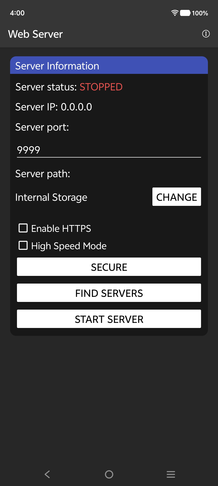 |  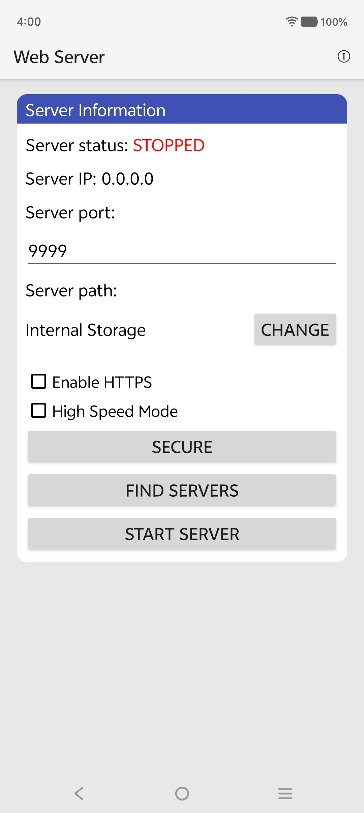 |
|  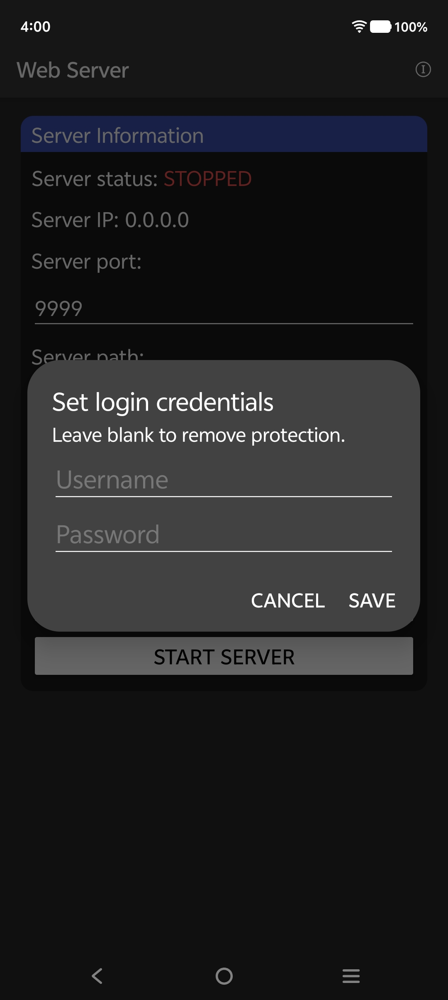 |  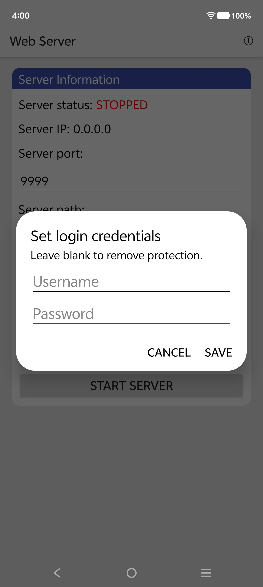 |
|  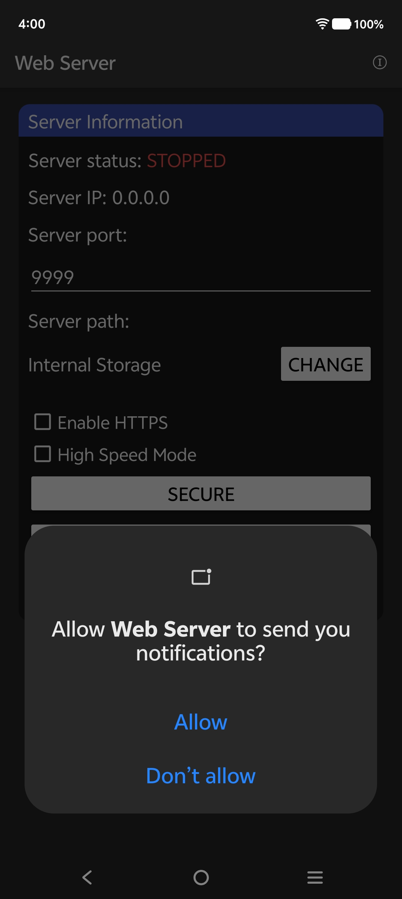 |  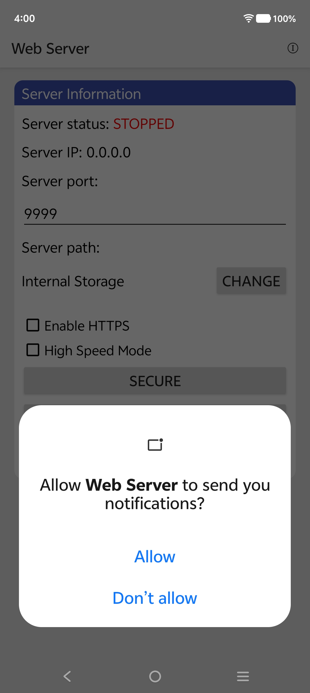 |
|  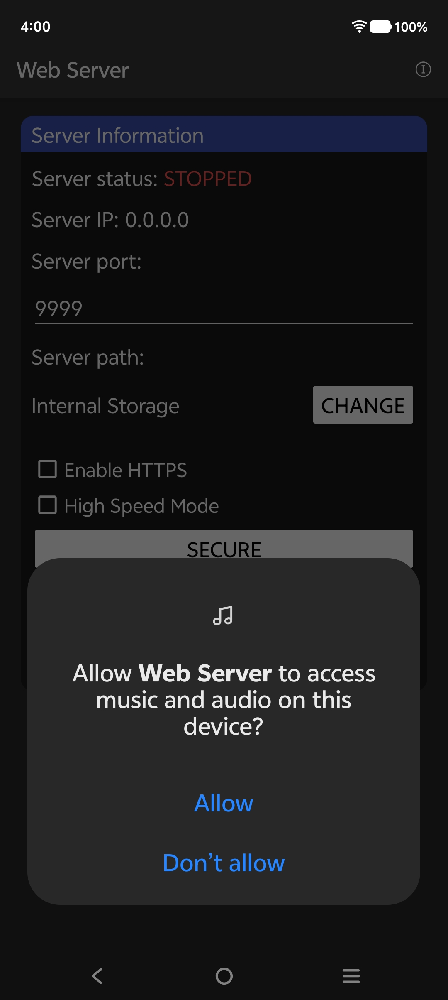 |  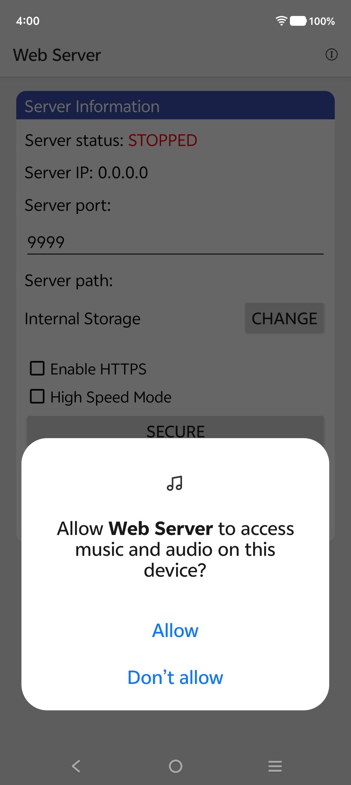 |
|  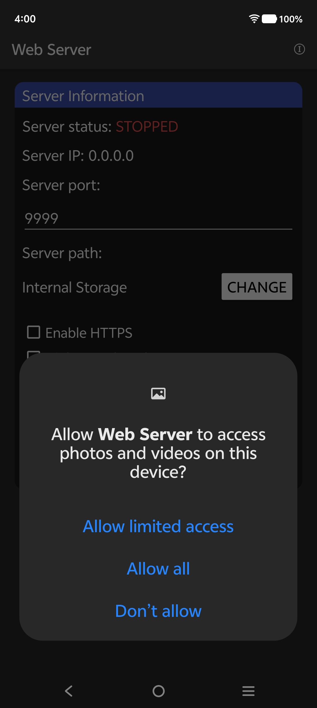 |  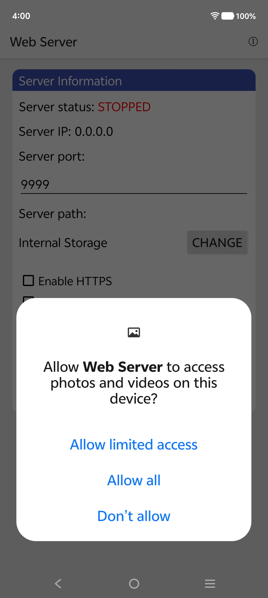 |
|   |  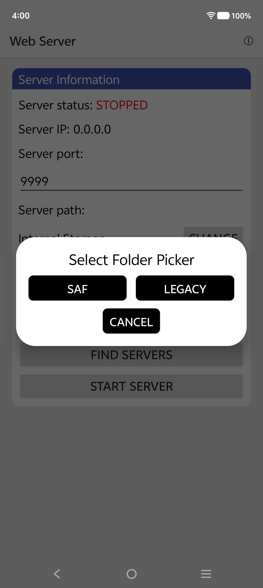 |
|  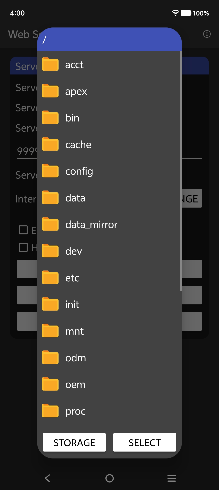 |   |
|   |   |
|  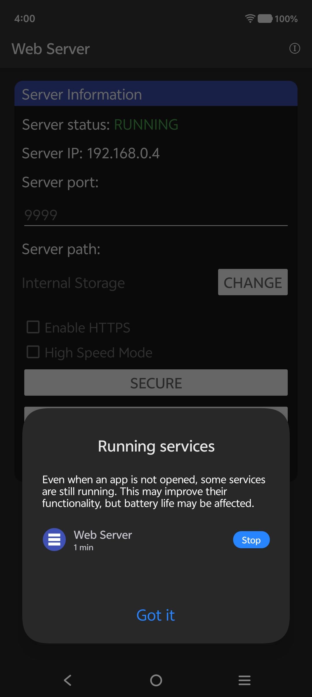 |   |
|  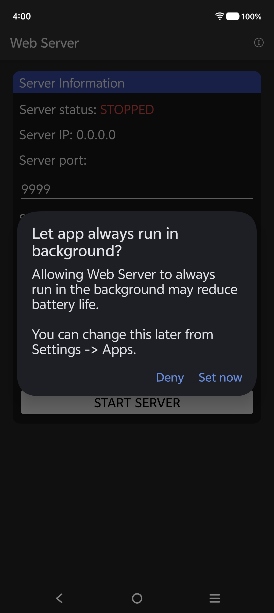 |  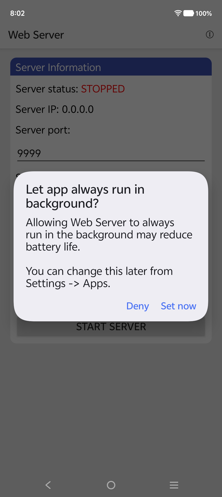 |

*All screenshots are original and show the app’s web interface, Android settings, and discovery dialogs.*

---

## 🚀 Quick Start – Install and Run in 60 Seconds

1. **Download the APK** from the [Releases page](https://github.com/toptstudio/WebServer-Android/releases). The file is named `Web Server.apk`.
2. **Install** it on your Android device (enable “Install from unknown sources” if needed).
3. **Grant permissions** when prompted: storage (to access your files) and notifications (for discovery alerts).
4. **Pick a folder** to share – tap “Change” and select a directory using the built‑in folder picker (SAF or legacy).
5. **Set a port** (default 9999). For port 80 or 443, root is required – the app will forward automatically if root access is available.
6. **Tap “Start Server”**. The IP address will appear (e.g., `192.168.1.100`).
7. **On another device**, open a web browser and go to `http://<your-phone-ip>:9999`.
   - If the other device has the same app, tap “Find Servers” – it will discover your server automatically. Tap the entry to open the browser.
8. **Start sharing** – browse, download, upload (if authentication enabled), stream media, or host websites.

---

## 📱 Usage Tips – Get the Most Out of Your Web Server

- **Finding your IP address** – shown on the main screen. For hotspot, it’s usually `192.168.43.1` or `192.168.0.1`. Also visible in Android Settings under “Hotspot & tethering”.
- **Uploading very large files (>2 GB)** – enable **Chunks Mode** in the web UI toggle. The upload will resume if interrupted.
- **Streaming media** – tap any video or audio file; modern browsers play it directly.
- **Hosting a website** – place your HTML/CSS/JS files (including `index.html`) in the shared folder. On the client, navigate to the folder and click `index.html`. All relative paths work.
- **Sharing a game** – upload an APK file; client clicks to download and install.
- **Setting a wallpaper** – browse images, long‑press and save; then set as wallpaper from your gallery.
- **Downloading a whole folder as ZIP** – click the download icon (📥) next to any folder. No temporary file is created on the server.
- **Enabling authentication** – tap “SECURE”, enter username/password. The web UI will show management buttons after login.
- **Disabling authentication** – clear the username and password fields in the “SECURE” dialog. The UI reverts to read‑only.
- **Stopping the server** – use the “Stop Server” button or the notification.
- **Discovery** – tap “Find Servers” to scan the network. Tap any discovered server to open its web UI; notifications alert you to new servers.

---

## ❓ Frequently Asked Questions (FAQ) – Web Server Android Edition

**Q1: How do I install this Web Server APK on Android 13, 14, or 15?**  
*A:* Download the APK from the Releases page. If Google Play Protect warns, tap “More details” → “Install anyway” (the app is 100% safe and open source). On Android 11+, the app will guide you to grant “All files access” using SAF if needed.

**Q2: Can I use this Android Web Server without Wi‑Fi?**  
*A:* Absolutely! Start a **Hotspot (Access Point)**. Others connect to your Wi‑Fi hotspot and access the server via the gateway IP. No router required.

**Q3: Does this WebServer support HTTPS (SSL)?**  
*A:* Yes. A self‑signed certificate is built in. Toggle HTTPS on/off from the main screen. When enabled, use `https://` in the browser.

**Q4: Is this Web Server App completely free?**  
*A:* Yes, 100% free and open source under the MIT License. No fees, no in‑app purchases, no premium versions.

**Q5: How do I change the port?**  
*A:* Use the “Port” input on the main screen (default 9999). Restart the server after changing. Rooted devices can use port 80 or 443.

**Q6: What is the maximum file size I can share?**  
*A:* No artificial limits – tested with files up to 100 GB. The chunked engine handles any size that fits your storage, bypassing FAT32’s 4 GB limit.

**Q7: How do I find the IP address of my Web Server?**  
*A:* The app displays both the Wi‑Fi IP and the Hotspot IP (if active) prominently on the main screen.

**Q8: Can I stream 4K video?**  
*A:* Yes. As long as your network bandwidth supports it (e.g., 5 GHz Wi‑Fi), 4K videos play smoothly in modern browsers.

**Q9: What happens if the app crashes during a large upload?**  
*A:* The chunked upload engine saves temporary chunks to SD card. When you restart the server and retry, it resumes from the last completed chunk – no data loss.

**Q10: How do I uninstall the WebServer APK?**  
*A:* Uninstall like any app from Android Settings. Your files remain untouched.

**Q11: Does this app drain my battery?**  
*A:* Minimal. It uses CPU only when actively serving requests; idle consumption is virtually zero.

**Q12: Can I share the APK with my friends directly?**  
*A:* Yes, use the “Share” button or host the APK file itself using this server, then send it via Bluetooth, Nearby Share, etc.

**Q13: What is the Phone-as-Web-Server concept?**  
*A:* It means using a mobile device as a fully functional web server for file serving, website hosting, and network services – without cloud infrastructure. WebServer-Android is a prime example.

**Q14: Can I use this for mobile‑first homelab projects?**  
*A:* Definitely! Perfect for running lightweight services, dashboards, or APIs on an old Android phone, reducing power and hardware costs.

**Q15: How does the resumable upload engine work?**  
*A:* Files are split into 10 MB chunks; a progress manifest tracks what’s uploaded. Only missing chunks are retransmitted, and all chunks are verified before assembly.

**Q16: How does the app handle duplicate files?**  
*A:* The deduplication system uses SHA‑256 hashing. For large files, smart three‑slice sampling provides near‑instant identification without hashing the entire file.

---

## 🔧 Troubleshooting Common Issues

- **“Cannot access server from other device”** – verify both devices are on the same network or hotspot. Disable “AP Isolation” on the router. Temporarily turn off firewalls or VPNs.
- **“mDNS Discovery not finding servers”** – some devices block multicast on hotspot. Use “Find Servers” (subnet probe) or manually enter the IP address.
- **“Upload fails on large files”** – enable “Chunks Mode” in the web UI and ensure enough free space on SD card for temporary chunks.
- **“HTTPS shows ‘Not Secure’”** – expected with a self‑signed certificate. Click “Advanced” → “Proceed to site” in your browser.
- **“App closes when minimized”** – ensure “Foreground Service” permission is granted. The persistent notification prevents Android from killing the process.

---

## 🔐 Permissions – Why They Are Needed and How They Are Used

| Permission | Requested on | Reason |
|------------|--------------|--------|
| `INTERNET` | Always | Required to run the web server and accept incoming connections. |
| `FOREGROUND_SERVICE` | Android 8+ | Allows the server to run in the background with an ongoing notification. |
| `POST_NOTIFICATIONS` | Android 13+ | For server status and discovery alerts – no other notifications are sent. |
| `MANAGE_EXTERNAL_STORAGE` | Android 11+ (optional) | Full file access; not required if SAF is used. |
| `ACCESS_WIFI_STATE`, `CHANGE_WIFI_MULTICAST_STATE` | Android 5+ | Needed for mDNS discovery. |
| `RECEIVE_BOOT_COMPLETED` | Android 5+ | Optional – enables auto‑start on device reboot (must be enabled in settings). |
| `WRITE_EXTERNAL_STORAGE` (max SDK 29) | Android 5–9 | Legacy permission; not used on Android 10+. |
| `ACCESS_COARSE_LOCATION` (max SDK 30) | Android 8–12 | Required for Wi‑Fi scanning (SSID) for mDNS; GPS is never used. |
| `NEARBY_WIFI_DEVICES` (min SDK 31) | Android 12+ | Modern replacement for location permission to access Wi‑Fi info. |

**No data leaves your device. No analytics, no tracking, no cloud services. All traffic stays on your local network.**

---

## 🗺️ Roadmap – Upcoming Features (2026–2027)

We are continually improving this **WebServer Topt Studio** project. Planned features include:
- **WebDAV Support** – mount the server as a network drive on Windows/macOS.
- **Custom 404 Pages** – define your own error pages.
- **Upload Speed Limiter** – control bandwidth usage.
- **Theme Customization** – additional color schemes for the web UI.
- **Auto‑start on Boot** – toggle to start the server automatically when the device powers on.
- **QR Code Generation** – instantly generate a QR code for the server URL.
- **Cloudflare Tunnel Integration** – optionally expose the server to the public internet via Cloudflare tunnels.

---

## 🤝 Contributing – Join the Open Source Community

This project is 100% open source (MIT license). Contributions are welcome!

- **Report bugs** – open an issue with steps to reproduce.
- **Suggest features** – open an issue with the “enhancement” label.
- **Submit pull requests** – fork the repo, create a branch, commit your changes, and open a PR.
- **Improve documentation** – the README, BUILD.md, or inline comments.

### Building from Source

See [`BUILD.md`](BUILD.md) for detailed instructions. In short:

1. Clone the repo: `git clone https://github.com/toptstudio/WebServer-Android.git`
2. Place `android.jar` (from Android SDK) and `r8.jar` (R8 dexer) in the project root.
3. Generate a keystore: `keytool -genkey -v -keystore webserver_signing.keystore -alias server -keyalg RSA -keysize 2048 -validity 10000 -storepass android -keypass android`
4. Run `./build.sh`
5. The APK will be at `bin/app-debug.apk`.

---

## 📜 License – MIT

Copyright (c) 2026 ToptStudio

Permission is hereby granted, free of charge, to any person obtaining a copy of this software and associated documentation files (the “Software”), to deal in the Software without restriction, including without limitation the rights to use, copy, modify, merge, publish, distribute, sublicense, and/or sell copies of the Software, and to permit persons to whom the Software is furnished to do so, subject to the following conditions:

The above copyright notice and this permission notice shall be included in all copies or substantial portions of the Software.

THE SOFTWARE IS PROVIDED “AS IS”, WITHOUT WARRANTY OF ANY KIND, EXPRESS OR IMPLIED, INCLUDING BUT NOT LIMITED TO THE WARRANTIES OF MERCHANTABILITY, FITNESS FOR A PARTICULAR PURPOSE AND NONINFRINGEMENT. IN NO EVENT SHALL THE AUTHORS OR COPYRIGHT HOLDERS BE LIABLE FOR ANY CLAIM, DAMAGES OR OTHER LIABILITY, WHETHER IN AN ACTION OF CONTRACT, TORT OR OTHERWISE, ARISING FROM, OUT OF OR IN CONNECTION WITH THE SOFTWARE OR THE USE OR OTHER DEALINGS IN THE SOFTWARE.

---

## 📬 Contact & Support

- **GitHub Issues:** [https://github.com/toptstudio/WebServer-Android/issues](https://github.com/toptstudio/WebServer-Android/issues)
- **Email:** toptstudio@gmail.com
- **Project Homepage:** [https://github.com/toptstudio/WebServer-Android](https://github.com/toptstudio/WebServer-Android)

**If you find this app useful, please ⭐ star the repository and share it with others!**

---

*Built with ❤️ for the open source community. No cloud, no tracking, just pure local file sharing.*
