# 📱 WebServer-Android: The #1 Offline Web Server APK for Android (2026) – Zero-Config Local File Sharing, 4K Media Streaming & Static Web Hosting (No Internet Required)

**The Most Advanced, Ultra-Lightweight Web Server Android App for Offline File Sharing, Media Streaming, and Website Hosting – Developed by Topt Studio.**

Are you searching for a reliable **Web Server Android** solution? Look no further. **WebServer-Android** is the definitive **Web Server APK** that transforms your smartphone, tablet, or Android TV box into a fully functional, production-grade HTTP/HTTPS server in under 60 seconds. Whether you need to share files across devices, stream 4K video to your laptop, host a static website without a cloud provider, or create an offline collaboration hub, this **Android Web Server** does it all.

This is the ultimate **WebServer Topt Studio** creation—crafted with pure Java, zero bloat, and zero dependencies. It leverages the **Phone-as-Web-Server** paradigm, turning your mobile device into a powerhouse for local network services. With native support for **Wi-Fi, Hotspot, and USB Tethering**, you can share files and host content anywhere, anytime—**no internet connection, no cloud uploads, and no data usage required**. The app is built from the ground up for **offline-first** operations, ensuring your data stays private and your sharing never hits a paywall.

---

## 📱 Android Version Support – From Android 5.0 Lollipop to Android 16+ (2026)

- **Minimum SDK:** API 21 (Android 5.0 Lollipop) – ensuring backward compatibility for devices released from 2014 onwards, including older phones, tablets, and Android TV boxes.
- **Target SDK:** API 36 (Android 16) – fully compatible with the latest Android versions, including betas and future releases.
- **Why such a wide range?** The app uses only standard Android APIs and pure Java sockets. No deprecated libraries, no forced updates, no compatibility wrappers. It will keep working on new Android versions without modification.
- **Optimised for low‑RAM devices** – automatically adjusts buffer sizes based on available memory. Works flawlessly on devices with 512 MB RAM (Android Go), 1 GB, 2 GB, and up.
- **No Google Play Services required** – pure open source, no tracking, no analytics.

---

## 🧠 The Intelligent Core: Under the Hood of Your Android Web Server

This **Web Server Android** app is not just a simple file sharer; it is a robust, enterprise-grade application built with a clean, modular architecture. Each component is meticulously engineered to provide a seamless and powerful experience.

### Intelligent Adaptive Performance
The server doesn't use a one-size-fits-all approach. It intelligently checks your device's total and available RAM to determine the optimal performance settings. On low-RAM devices (≤1 GB), it uses conservative memory settings to prevent crashes. On high-end devices with 6+ GB of RAM, it scales up for maximum throughput. This ensures a stable experience on everything from budget Android Go phones to flagship devices.

### Resumable Upload Engine for Large Files
Uploading large files over an unstable network is a common pain point. Our intelligent upload engine solves this with an enterprise-grade chunked upload system:

- **10 MB Chunking:** Files are intelligently split into 10 MB chunks. If a connection drops, only the missing chunks are retransmitted, saving time and bandwidth.
- **Persistent Progress Tracking:** For every upload, a progress manifest is created. This allows the server to resume an upload from where it left off, even after a crash or device reboot.
- **Data Integrity Assurance:** The system meticulously checks for all chunks before combining them into the final file, ensuring your data is never corrupted.

### Enterprise-Grade Security
Security is paramount, and the app provides a robust, thread-safe authentication mechanism for your **Web Server APK**:

- **Basic HTTP Authentication:** Protect your server with a username and password using the standard `Basic` authentication scheme.
- **Secure Password Handling:** The system is designed to be thread-safe, ensuring reliable authentication even under heavy load.
- **Reliable Base64 Encoding:** Uses industry-standard encoding to prevent issues with authentication header parsing.

### Zero-Configuration Auto-Discovery (mDNS)
Say goodbye to typing IP addresses. The built-in zero-configuration discovery system makes your server instantly discoverable on the local network:

- **Automatic Broadcasting:** Uses Android's native service discovery to broadcast and discover services on the local network, enabling automatic server discovery.
- **Persistent Background Discovery:** The discovery service runs intelligently in the background, ensuring it can find servers even when the app is in the background.
- **Smart Caching:** The system caches up to 50 discovered servers, allowing for quick reconnection and a seamless user experience.

### Intelligent Deduplication System
This feature prevents redundant uploads, saving both time and storage space:

- **SHA-256 Hashing:** Uses the SHA-256 algorithm to generate a unique fingerprint for files, ensuring accurate identification of duplicates.
- **Smart Sampling for Large Files:** For large files, instead of hashing the entire file (which is time-consuming), it uses a clever three-slice sampling method to quickly identify potential duplicates. This provides a near-instantaneous response for files over 10 MB.
- **Server-Side Verification:** The system verifies a file's identity using sample bytes sent by the client, making the deduplication process highly efficient.

### Built-in HTTPS for Secure Connections
Security is a top priority. A self-signed SSL certificate is embedded directly into the app, allowing you to enable HTTPS with a single tap:

- **Pre-Embedded Certificate:** No need for users to generate their own certificates.
- **One-Tap HTTPS:** Instantly switch between HTTP and HTTPS, securing your data in transit.

### Comprehensive Logging for Troubleshooting
A lightweight logging system ensures that all server activities, errors, and events are recorded for easy troubleshooting:

- **Time-Stamped Logs:** Every log entry includes a precise timestamp, making it easy to trace events.
- **Exception Tracking:** Captures and logs errors, which is invaluable for debugging.

### User-Friendly Troubleshooting Guide
The app includes a comprehensive, in-app help dialog that guides users through common network configuration issues:

- **Step-by-Step Guide:** Offers a clear, structured guide for troubleshooting network connectivity, covering router settings (AP Isolation, IGMP Snooping), firewall rules, and Android-specific checks (Location permissions, Battery optimization).

---

## 🔍 What Makes This Android Web Server Unique? (Complete Feature List)

This **WebServer** is not just another file sharer. It is a production-grade HTTP/1.1 server packed into an APK under 0.5 MB. Here is why it stands out among other **Android Web Server** applications:

| Category | Feature | Detailed Description |
|----------|---------|----------------------|
| **Size & Performance** | APK < 0.5 MB | The entire app is under half a megabyte. Installs in seconds, uses almost no storage. Perfect for devices with limited space. |
| **Upload Engine** | Resumable Chunked Uploads | Large files are split into 10 MB chunks. If the connection drops or the app is closed, only missing chunks are retransmitted. No restart from zero. |
| **Upload Engine** | 100 GB+ File Support | Tested with files up to 100 gigabytes. No artificial limits. The chunked engine handles any size that fits your storage. |
| **Download** | Single File or Full Folder as ZIP | Click the download button next to any file to get it. Click the folder download button to instantly pack the entire folder into a ZIP archive and stream it to your browser. |
| **Media Streaming** | 4K Video Streaming | Supports MP4, MKV, AVI, MOV, WebM, M4V, 3GP, and more. Browser plays natively without transcoding. |
| **Media Streaming** | High-Resolution Audio Streaming | Supports MP3, FLAC, OGG, WAV, M4A, AAC, Opus, and many others. |
| **Media Streaming** | Image Preview | JPEG, PNG, GIF, SVG, WebP, BMP, TIFF – view directly in browser. |
| **Web Hosting** | Static HTML/CSS/JS Hosting | Upload an entire website (e.g., portfolio, documentation, single‑page app). Click any `.html` file – it renders as a real webpage. |
| **File Management** | Delete (Authenticated) | When authentication is enabled, users can delete files or folders via the web UI. |
| **File Management** | Rename (Authenticated) | Change file or folder names directly from the browser. |
| **File Management** | Create Folder (Authenticated) | Create new subfolders remotely. |
| **File Management** | Upload (Authenticated) | Drag & drop files from your computer or phone browser. Supports chunked mode for large uploads. |
| **Security** | Basic HTTP Auth | Set a username and password via the "SECURE" button in the app. When enabled, the web UI shows action buttons (delete, rename, upload, create folder). |
| **Discovery** | mDNS (Bonjour/Zeroconf) | Automatically advertises the server on the local network. Other devices running the app can find it without typing IP/port. |
| **Discovery** | One‑Tap Browser Open | Tap a discovered server in the list – the app opens your browser directly to that server's address. |
| **Discovery** | System Notifications | When a new server is discovered, you receive a notification. Tap it to open the web UI instantly. |
| **Discovery** | Background Service | Discovery runs as a foreground service. It can continue even when the app is closed (you can stop it anytime). |
| **Network** | Wi‑Fi Client Mode | All devices on the same router can see each other if AP isolation is disabled. |
| **Network** | Hotspot (Access Point) Mode | Start a hotspot on your Android. Other devices connect and access the server via the gateway IP (e.g., `192.168.43.1`). No internet needed. |
| **Network** | Cellular Fallback | If Wi‑Fi is off, the server binds to the cellular IP. Useful for USB tethering or direct 5G sharing. |
| **Network** | No Internet Required | All traffic stays local. Your files never leave the room. No data usage. |
| **Performance** | High‑Speed Mode | Disables Nagle's algorithm, increases socket buffers, and reduces latency for large transfers. |
| **Performance** | Adaptive Buffer Size | The app measures available RAM and sets optimal read/write buffers (64 KB – 4 MB). |
| **Security** | Built-in HTTPS | Built‑in self‑signed certificate (generated at build time). Toggle HTTPS on/off from the main screen. |
| **Security** | Root Port Forwarding | If your device is rooted, the app can forward ports 80 and 443 to your chosen port, allowing standard web ports. |
| **Storage** | Storage Access Framework (SAF) | Pick any folder on internal or external storage (SD card, USB drive) without legacy permissions. |
| **Storage** | Legacy Storage Fallback | For older Android versions or full file access, uses traditional file paths. |
| **Resilience** | Resumable After Crash | The chunked upload engine stores temporary files on SD card. If the app or device crashes, uploads resume from the last complete chunk. |
| **UI** | Dark / Light Theme | Automatically follows system theme. All screenshots show both modes. |
| **UI** | Responsive Web Interface | Works on phones, tablets, laptops, desktops. Uses CSS grid and flexbox. |
| **Extras** | Share APK Games | Upload APK files or game ROMs. Others download and install directly. |
| **Extras** | Share Wallpapers | Browse high‑resolution images and save them to your device. |
| **Extras** | Share Documents | PDF, Office files, e‑books, etc. – the browser's built‑in viewer handles many formats. |

---

## 🆚 WebServer-Android vs. Other Android Web Servers (Comparison)

Why choose this **Web Server APK** over KSWEB, AWebServer, Localhost Lite, or others?

| Feature | **WebServer-Android (Topt Studio)** | KSWEB (Paid) | AWebServer | Localhost Lite |
|---------|--------------------------------------|--------------|------------|----------------|
| **APK Size** | **< 0.5 MB** | ~15 MB | ~10 MB | ~2 MB |
| **Price** | **Free (MIT License)** | Paid / Freemium | Free | Free |
| **Resumable Chunked Upload** | ✅ Yes | ❌ No | ❌ No | ❌ No |
| **mDNS Auto-Discovery** | ✅ Yes | ✅ Yes | ❌ No | ❌ No |
| **Hotspot Mode (No Wi-Fi)** | ✅ Yes | ⚠️ Limited | ❌ No | ❌ No |
| **HTTPS Built-in** | ✅ Yes | ✅ Yes | ❌ No | ❌ No |
| **File Management (Delete/Rename)** | ✅ Yes (Secure Mode) | ✅ Yes | ❌ No | ❌ No |
| **Stream ZIP Folders** | ✅ Yes | ❌ No | ❌ No | ❌ No |
| **Android 16+ Support** | ✅ Yes | ⚠️ Unknown | ⚠️ Unknown | ⚠️ Unknown |
| **PHP/MySQL Support** | ❌ No (Pure Static) | ✅ Yes | ✅ Yes | ❌ No |

**The verdict:** If you are searching for a **Web Server Topt Studio** solution that is lightweight, completely free, and packed with enterprise-grade features like resumable uploads and hotspot hosting, this is the clear winner. Unlike heavier alternatives like KSWEB or AWebServer, which are designed for PHP development, **WebServer-Android** focuses on what matters most: **blazing-fast file sharing, media streaming, and static web hosting** with zero bloat.

---

## 🌐 Web UI Features – Public vs. Secure Mode

### 🔓 Public Mode (Authentication Disabled – Default)
- **Browse** any folder.
- **Download** any file with one click.
- **Download entire folder as ZIP** – the server compresses on the fly.
- **Inline preview** for images, videos, audio, text, HTML, PDF.
- **No delete, rename, upload, or create folder** – visitors cannot modify your files.

### 🔒 Secure Mode (Authentication Enabled via "SECURE" Button)
Once you set a username and password in the app, the web UI shows **additional action buttons** for authenticated users:

| Action | Button | Description |
|--------|--------|-------------|
| Delete | 🗑️ | Remove a file or folder. |
| Rename | 📝 | Change the name of a file or folder. |
| Upload | 📤 | Upload files (drag & drop or file picker). Supports resumable chunked upload for large files. |
| Create Folder | 📁 | Create a new subfolder. |

All public features (browse, download, ZIP, preview) remain available.

> **Why this design?** Without authentication, the web UI is read‑only – safe for public sharing. With authentication, you get full remote file management from any browser.

---

## 🔍 Automatic Discovery & Notifications – No More Typing IP Addresses

- **Find Servers button** – Tap it on any device running WebServer. The app scans the local network using mDNS and HTTP probes.
- **One‑click browser open** – Discovered servers appear in a list. Tap any entry – the app opens your browser directly to that server's IP and port. **No manual address entry.**
- **System notifications** – When a new server is discovered, you receive a notification. Tap the notification to instantly open the web UI of that remote server.
- **Background discovery service** – The discovery runs as a foreground service. Even when the app is closed, discovery can continue (you can stop it via the "Stop Discovery" button).
- **Manual fallback** – If automatic discovery fails (e.g., router isolates multicast), you can still enter the IP and port manually in your browser.

> 💡 **Perfect for quick file sharing between friends:** both install the app, one starts the server, the other taps "Find Servers" – and connects in seconds.

---

## 🌐 Network Support – Wi‑Fi, Hotspot, Cellular (No Internet Needed)

This **Android Web Server** gives you complete flexibility over how you share.

- **Wi‑Fi client mode** – All devices on the same router can see each other if AP isolation is disabled. Most home networks allow this.
- **Hotspot (access point) mode** – Start a hotspot on your Android. Other devices connect to your hotspot and access the server via the gateway IP (usually `192.168.43.1` or `192.168.0.1`). Works without any internet connection. Perfect for outdoor sharing, camping, or airplane mode use.
- **Cellular fallback** – If Wi‑Fi is off, the server binds to the cellular IP. This is useful for USB tethering or direct 5G sharing between two phones (using a cable or Wi‑Fi Direct).
- **No internet required** – All traffic stays local. Your files never leave the room. No data usage. No privacy concerns.

**Discovery across hotspot:** mDNS may be limited on some Android hotspot implementations. However, the app's manual discovery (Find Servers) probes the subnet directly, so it will find other instances even if mDNS is blocked. You can also enter the IP address directly.

---

## ⚡ Performance & Efficiency – Why This Web Server APK Is So Fast

- **Ultra‑lightweight** – Entire APK is **under 0.5 MB**. Compare to other web servers that are 5–20 MB. No bloated frameworks (no Retrofit, OkHttp, Volley, etc.). Pure Java sockets.
- **Resumable chunked upload engine** – Files are split into 10 MB chunks. The server keeps a progress manifest. If connection cuts, only missing chunks are re‑sent.
- **Optimised for unstable networks** – The temporary folder for chunks is stored on SD card (or internal storage). Even if the app crashes or the device reboots, uploads can resume.
- **High‑speed mode** – Disables Nagle's algorithm, increases socket buffers, and reduces latency for many small packets.
- **Adaptive buffer size** – The app checks total RAM and available RAM on start. On low‑RAM devices (≤1 GB), buffer size is 64 KB; on high‑RAM devices (≥6 GB), buffer size can be up to 512 KB. This prevents out‑of‑memory errors.
- **Concurrent connection limit** – The server limits active connections to 20 to avoid exhausting file descriptors.
- **No database, no caching** – Direct file serving. Minimal overhead.

---

## 🎬 Media Streaming & Web Hosting – A Real HTTP Server in Your Pocket

Because this is a **real HTTP/HTTPS server** implementing RFC 2616 (HTTP/1.0 and 1.1), any browser can:

- **Play videos** – MP4, MKV, AVI, MOV, WebM, M4V, 3GP, etc. (browser codec support varies). The server sends proper `Content-Type` headers based on file extension (over 500 mime types supported).
- **Play music** – MP3, FLAC, OGG, WAV, M4A, AAC, Opus, WebM audio – stream directly without downloading.
- **View images** – JPEG, PNG, GIF, SVG, WebP, BMP, TIFF, even RAW (browser dependent).
- **Render HTML websites** – Upload an entire static site (HTML, CSS, JS, images, fonts) into a folder. Navigate to that folder and click any `.html` file – it will render as a webpage. All relative links work because the server resolves paths correctly.
- **Download games & apps** – Share APK files, game ROMs (e.g., NES, SNES, PlayStation), Windows installers, Linux packages. Users just tap to download.
- **Set wallpapers** – Browse high‑resolution images (e.g., 4K wallpapers) and save them to your device using the browser's "Save image as".
- **View PDFs and Office documents** – The browser's built‑in PDF viewer and Office Online (if available) can handle these files. The server sends the correct mime types (`application/pdf`, `application/msword`, etc.).

The web UI is fully responsive and works on phones, tablets, laptops, and desktops – **no client app required**. The UI includes:
- A file browser with sorting (folders first, then files alphabetically).
- Download buttons for each file and folder (ZIP).
- Action buttons (delete, rename, upload, create folder) when authentication is enabled.
- A modern CSS grid layout with dark/light mode support.
- JavaScript for chunked uploads, progress indicators, and duplicate handling.

---

## 💼 Real-World Use Cases for this Android Web Server

This **WebServer Topt Studio** app isn't just a tech demo. Here are practical ways people use it every day:

1. **For Digital Nomads & Travelers:** Share photos, videos, and documents with friends in remote areas where there is no Wi-Fi or cellular signal. Just start the Hotspot and let them connect. No cloud, no data charges.
2. **For Developers & QA Testers:** Test your responsive web applications on real Android devices instantly. Upload your build to the phone, start the server, and open it on an iPad or laptop within the same network to test cross-browser compatibility.
3. **For Gamers:** Host classic game ROMs (NES, SNES, PSP) on your phone. Your friends can download them directly via the browser without needing a USB cable or cloud storage.
4. **For Students & Teachers:** Distribute lecture notes, PDFs, and assignment files to an entire classroom offline. Everyone connects to the teacher's hotspot and downloads the materials simultaneously.
5. **For Content Creators:** Share raw 4K video footage with your editing team on set without waiting for slow cloud uploads. The server streams the footage directly to their laptops.
6. **For IoT & Smart Home Enthusiasts:** Host a lightweight control panel for your IoT devices directly from an old Android phone, creating a dedicated, always-on local dashboard.
7. **For Offline Documentation:** Keep technical documentation, user manuals, or wikis accessible on a local network without needing an internet connection—perfect for workshops, labs, or remote sites.

---

## 📸 Screenshot Gallery – Dark Mode, Light Mode, and Mixed

### 🌗 Mixed Mode (both dark and light)
This image shows the device main screen.

  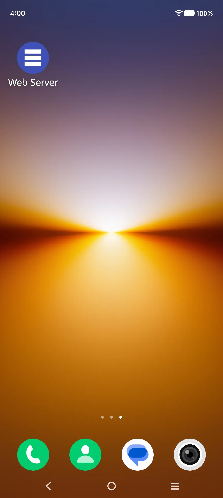
   <em>The app's main screen in default mixed theme.</em>

 

### 🌙 Dark Mode vs ☀️ Light Mode
The following table compares pure Dark Mode on the left and pure Light Mode on the right.

| Dark Mode | Light Mode |
|:---------:|:----------:|
|  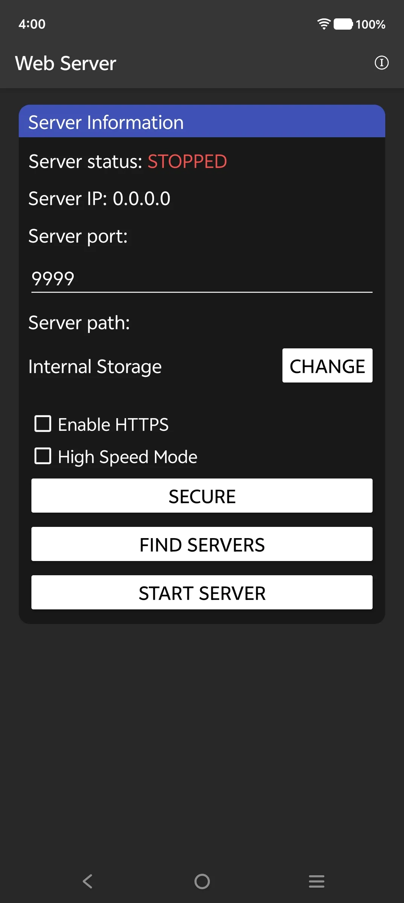 |   |
|  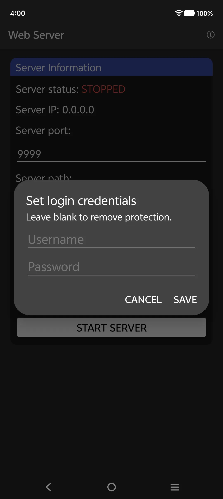 |  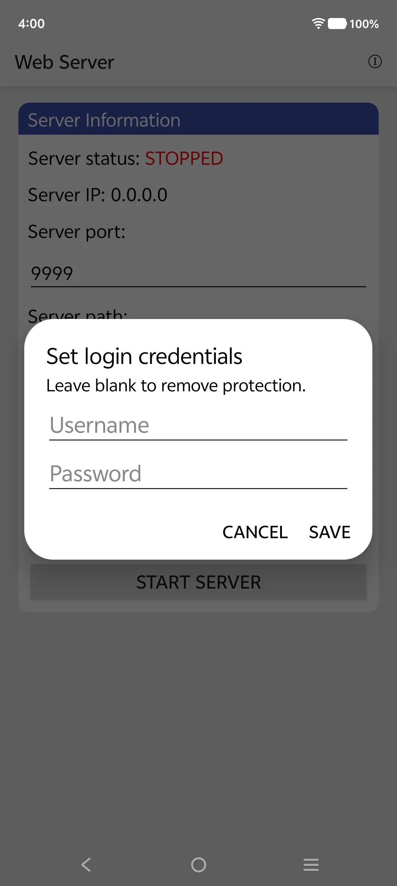 |
|  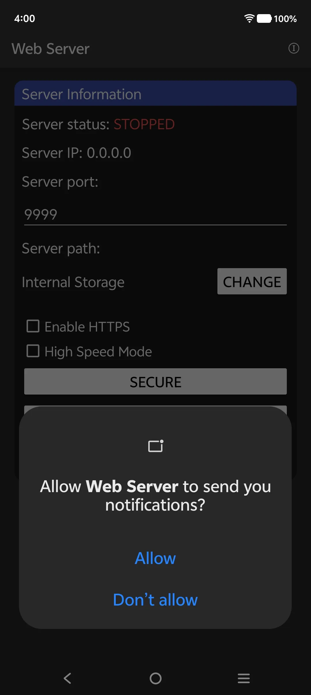 |  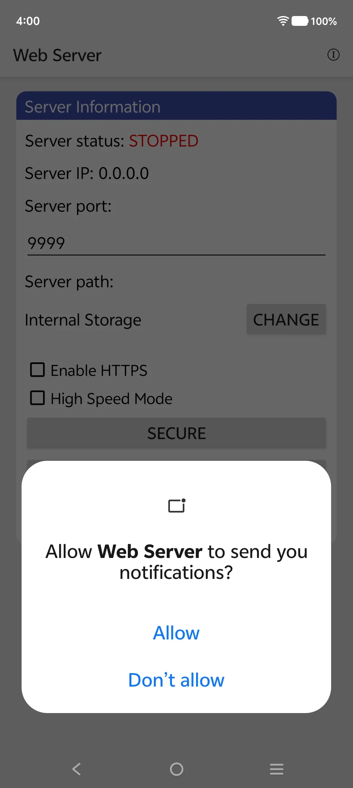 |
|  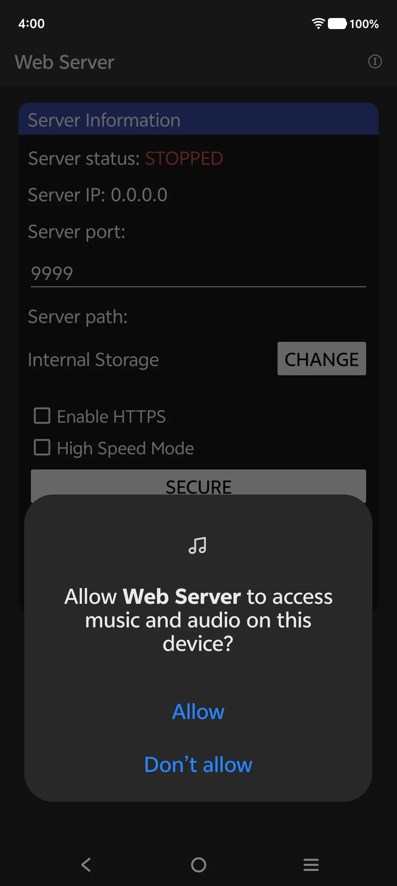 |  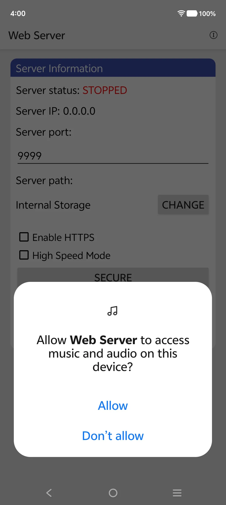 |
|  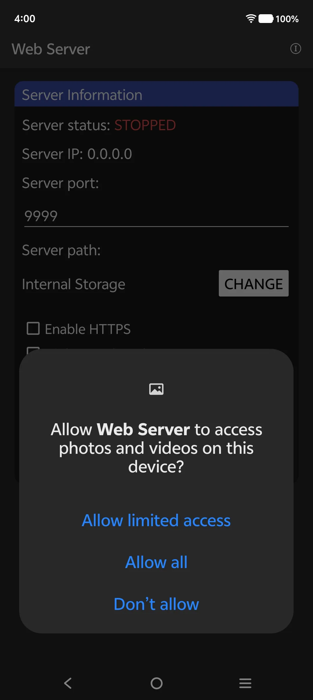 |  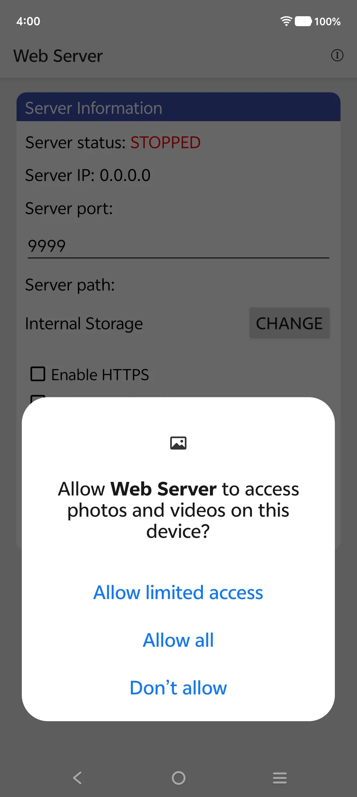 |
|  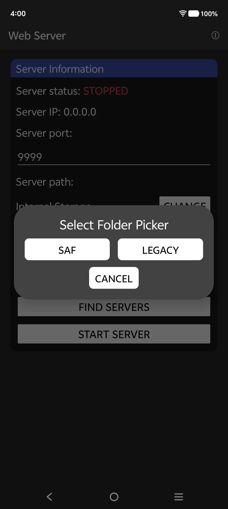 |  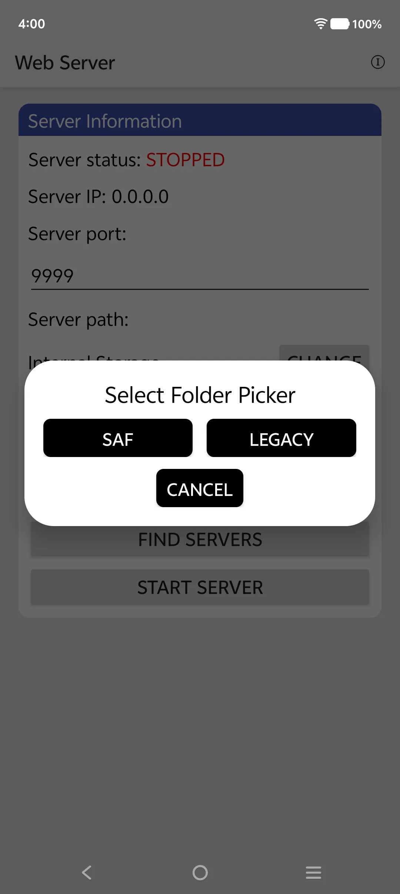 |
|  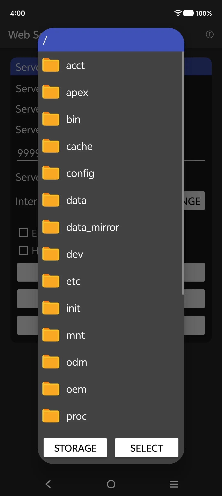 |  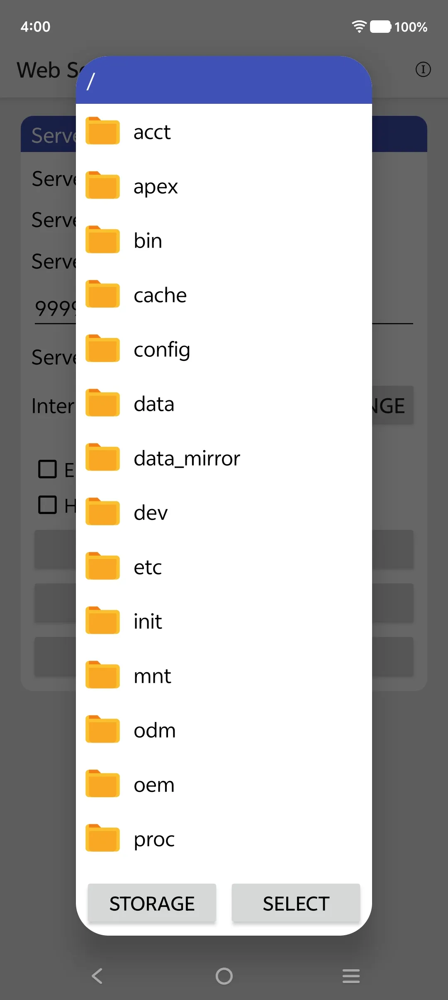 |
|  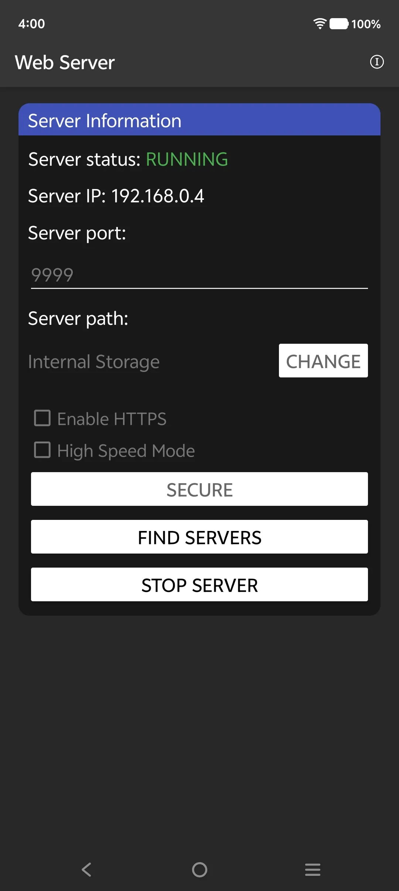 |  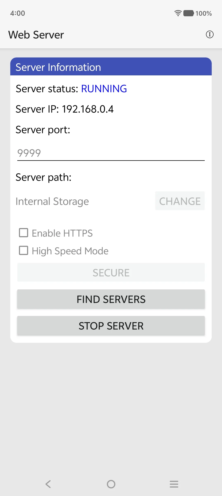 |
|  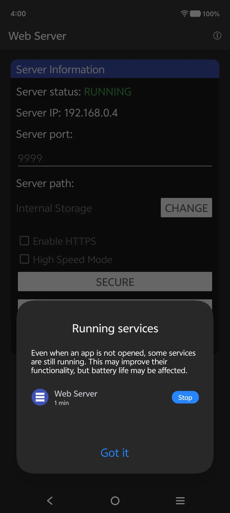 |  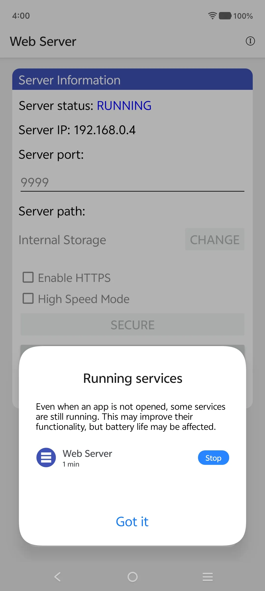 |
|   |  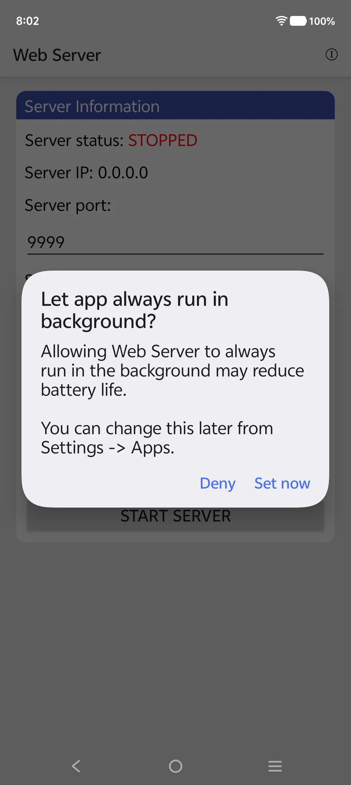 |

*All screenshots are original and show the app's web interface, Android settings, and discovery dialogs.*

---

## 🚀 Quick Start – Install and Run in 60 Seconds

1. **Download the APK** from the [Releases page](https://github.com/toptstudio/WebServer-Android/releases). The file is named `WebServer-v1.0.0.apk`.
2. **Install** it on your Android device (enable "Install from unknown sources" if needed).
3. **Grant permissions** when prompted: storage (to access your files) and notifications (for discovery alerts).
4. **Pick a folder** to share – tap "Change" and select a directory using the built‑in folder picker (SAF or legacy).
5. **Set a port** (default 9999). If you want to use port 80 or 443, your device must be rooted – the app will automatically forward those ports if root is available.
6. **Tap "Start Server"**. The server will start, and the IP address will appear (e.g., `192.168.1.100`).
7. **On another device** (phone, tablet, laptop, desktop), open a web browser and go to `http://<your-phone-ip>:9999`.
   - Alternatively, if the other device has the same app installed, tap "Find Servers" – it will discover your server automatically. Tap the discovered entry to open the browser.
8. **Share files** – browse, download, upload (if authentication enabled), stream media, or host websites.

---

## 📱 Usage Tips – Get the Most Out of Your Web Server

- **Finding your IP address** – The app displays the server IP on the main screen. If you're using a hotspot, the IP is usually the hotspot gateway (e.g., `192.168.43.1` or `192.168.0.1`). You can also find it in Android settings under "Hotspot & tethering".
- **Uploading very large files ( >2 GB )** – Enable **Chunks Mode** in the web UI (toggle switch). The app will then upload the file in 10 MB chunks. Even if the connection drops, the upload will resume from the last completed chunk. The temporary chunk directory is stored on your SD card or internal storage.
- **Streaming media** – Just tap any video or music file in the web interface. Your browser will play it directly (provided the codec is supported). For best results, use modern browsers like Chrome, Firefox, Edge, or Safari.
- **Hosting a website** – Create a folder on your device, put your HTML/CSS/JS files inside (including an `index.html`). In the app, share that folder. On the client browser, navigate to the folder and click `index.html`. The browser will render the website. All relative paths (images, CSS, JS) will work.
- **Sharing a game** – Upload an APK file. On the client, click the APK to download it. Then install it normally. Works for any file type.
- **Setting a wallpaper** – Browse the images folder, tap any high‑resolution image. On most browsers, you can long‑press the image and select "Save image". Then set as wallpaper from your gallery.
- **Downloading a whole folder as ZIP** – Click the download icon (📥) next to any folder. The server will pack the folder's entire contents into a ZIP archive and stream it to your browser. No temporary file is created on the server.
- **Enabling authentication** – Tap the "SECURE" button in the app. Enter a username and password. From now on, the web UI will require these credentials. Once logged in, you will see delete, rename, upload, and create folder buttons.
- **Disabling authentication** – Go back to the "SECURE" dialog and clear both username and password fields. Save. The web UI will revert to read‑only mode.
- **Stopping the server** – Tap "Stop Server" in the app. You can also stop it from the notification (if running as foreground).
- **Discovery** – Tap "Find Servers". The app will scan the local network for other WebServer instances. Discovered servers appear in a list. Tap any to open its web UI directly. You will also receive notifications for new servers.

---

## ❓ Frequently Asked Questions (FAQ) – Web Server Android Edition

**Q1: How do I install this Web Server APK on Android 13, 14, or 15?**  
*A:* Download the APK from the Releases section. When installing, if Google Play Protect shows a warning, tap "More details" and then "Install anyway" (this is because the app is not from the Play Store, but it is 100% safe and open source). On Android 11+, you may need to grant "All files access" via the SAF picker, which the app guides you through.

**Q2: Can I use this Android Web Server without Wi-Fi?**  
*A:* Absolutely! This is one of the core features. You can start a **Hotspot (Access Point)** directly from your Android device. Other users connect to your Wi-Fi hotspot and access the server via the gateway IP (e.g., `192.168.43.1`). No internet router is required.

**Q3: Does this WebServer support HTTPS (SSL)?**  
*A:* Yes. The app includes a built-in self-signed certificate. You can toggle HTTPS on/off directly from the main screen. When enabled, the server will use `https://` instead of `http://`.

**Q4: Is this Web Server App completely free?**  
*A:* Yes, it is 100% free and open-source under the MIT License. There are no hidden fees, no in-app purchases, and no premium versions. You get the full feature set for life.

**Q5: How do I change the port on this Android Web Server?**  
*A:* On the main app screen, you will see a "Port" input field (default is `9999`). Simply type a new number (e.g., `8080`) and restart the server. If your device is rooted, you can use ports `80` or `443`.

**Q6: What is the maximum file size I can share using this Web Server APK?**  
*A:* The server has no artificial limits. It supports files up to 100 GB (tested). The chunked upload engine splits large files into 10 MB parts, so even if your storage is formatted as FAT32 (which has a 4GB limit), the app bypasses this by chunking on the fly.

**Q7: How do I find the IP address of my Web Server?**  
*A:* The app displays the server IP prominently on the main screen right after you start the server. It shows both the Wi-Fi IP and the Hotspot IP (if active).

**Q8: Can I stream 4K video using this Android Web Server?**  
*A:* Yes. The server streams raw video data efficiently. As long as your Wi-Fi or Hotspot bandwidth supports it (e.g., 5GHz Wi-Fi), 4K videos play smoothly in browsers that support the codec (e.g., H.264/H.265 in Chrome or VLC).

**Q9: What happens if the app crashes during a large upload?**  
*A:* The chunked upload engine saves temporary chunk files to the SD card. When you restart the server and re-attempt the upload, the app automatically detects the existing chunks and resumes from the last completed chunk. No data is lost.

**Q10: How do I uninstall the WebServer APK?**  
*A:* Just like any other Android app. Go to Settings > Apps > WebServer > Uninstall. Your files are untouched; only the app is removed.

**Q11: Does this app drain my battery?**  
*A:* Minimal. Because it is a pure Java socket server with no background polling, it only uses CPU when actively serving a request. When idle, it consumes virtually zero battery.

**Q12: Can I share the APK with my friends directly?**  
*A:* Yes. You can use the "Share" button in the app or simply send the APK file via Bluetooth, Nearby Share, or even host it using this very server!

**Q13: What is the Phone-as-Web-Server concept?**  
*A:* The **Phone-as-Web-Server** paradigm refers to using a mobile device as a fully functional web server, serving files, hosting websites, and providing network services—all without relying on traditional cloud infrastructure. WebServer-Android is a prime example of this approach, turning your Android device into a portable, self-contained server.

**Q14: Can I use this for mobile-first homelab projects?**  
*A:* Absolutely! With the rise of **mobile-first homelab** setups, WebServer-Android is perfect for running lightweight services, hosting dashboards, or serving APIs directly from an old Android phone, reducing power consumption and hardware costs.

**Q15: How does the resumable upload engine work?**  
*A:* The engine splits files into 10 MB chunks. It creates a progress manifest to track what has been uploaded. If an upload is interrupted, only the missing chunks are retransmitted. The system then meticulously checks for all chunks before combining them into the final file, ensuring data integrity.

**Q16: How does the app handle duplicate files to save time?**  
*A:* The intelligent deduplication system uses SHA-256 hashing to identify duplicates. For large files, it uses a smart three-slice sampling method for quick identification, avoiding the need to hash the entire file.

---

## 🔧 Troubleshooting Common Issues

- **"Cannot access server from other device"** – Ensure both devices are on the same Wi-Fi network or connected to the same hotspot. Check if the router has "AP Isolation" enabled (disable it). Try disabling your firewall or VPN.
- **"mDNS Discovery not finding servers"** – Some Android devices block multicast on hotspot. Use the "Find Servers" button which probes the subnet directly, or manually enter the IP address in the browser.
- **"Upload fails on large files"** – Ensure you have enabled "Chunks Mode" in the web UI. Also, check that your SD card has enough free space for temporary chunk storage.
- **"HTTPS shows 'Not Secure'"** – This is expected because the certificate is self-signed. Click "Advanced" > "Proceed to site" in your browser to continue safely.
- **"App closes when minimized"** – Ensure you have granted the "Foreground Service" permission. The app shows a persistent notification to prevent Android from killing it.

---

## 🔐 Permissions – Why They Are Needed and How They Are Used

| Permission | Requested on | Reason |
|------------|--------------|--------|
| `INTERNET` | Always | Required to run the web server and accept incoming connections. |
| `FOREGROUND_SERVICE` | Android 8+ | Allows the server to run in the background without being killed. The app shows an ongoing notification. |
| `POST_NOTIFICATIONS` | Android 13+ | Used to show server status notifications and discovery alerts. The app does not send any other notifications. |
| `MANAGE_EXTERNAL_STORAGE` | Android 11+ (optional) | Grants full file access. This permission is **not required** if you use SAF (Storage Access Framework). The app works perfectly without it by using SAF. |
| `ACCESS_WIFI_STATE`, `CHANGE_WIFI_MULTICAST_STATE` | Android 5+ | Needed for mDNS discovery (to find other servers on the same Wi‑Fi). |
| `RECEIVE_BOOT_COMPLETED` | Android 5+ | Optional – if you want the server to auto‑start after device reboot. You must enable it in the app's settings. |
| `WRITE_EXTERNAL_STORAGE` (max SDK 29) | Android 5–9 | Legacy permission for devices before Android 10. Not used on newer Android versions. |
| `ACCESS_COARSE_LOCATION` (max SDK 30) | Android 8–12 | Required for Wi‑Fi scanning to get SSID (used by mDNS). The app does not use GPS. |
| `NEARBY_WIFI_DEVICES` (min SDK 31) | Android 12+ | Modern replacement for location permission to access Wi‑Fi information. |

**No data leaves your device. No analytics, no tracking, no cloud services. All network traffic is local to your Wi‑Fi or hotspot.**

---

## 🗺️ Roadmap – Upcoming Features (2026–2027)

We are constantly improving this **WebServer Topt Studio** project. Planned features include:
- **WebDAV Support** – Mount the server as a network drive on Windows/Mac.
- **Custom 404 Pages** – Allow users to define their own error pages.
- **Upload Speed Limiter** – Control bandwidth usage.
- **Theme Customization** – More color schemes for the web UI.
- **Auto-start on Boot** – Toggle to start the server automatically when the device powers on.
- **QR Code Generation** – Instantly generate a QR code for the server URL to simplify connection.
- **Cloudflare Tunnel Integration** – Optionally expose the server to the public internet via Cloudflare tunnels.

---

## 🤝 Contributing – Join the Open Source Community

This project is 100% open source (MIT license). Contributions are welcome!

- **Report bugs** – Open an issue on GitHub with steps to reproduce.
- **Suggest features** – Open an issue with the "enhancement" label.
- **Submit pull requests** – Fork the repo, create a branch, commit your changes, and open a PR.
- **Improve documentation** – The README, BUILD.md, or inline code comments.

### Building from Source

See [`BUILD.md`](BUILD.md) for detailed instructions. In short:

1. Clone the repo: `git clone https://github.com/toptstudio/WebServer-Android.git`
2. Place `android.jar` (from Android SDK) and `r8.jar` (R8 dexer) in the project root.
3. Generate a keystore: `keytool -genkey -v -keystore webserver_signing.keystore -alias server -keyalg RSA -keysize 2048 -validity 10000 -storepass android -keypass android`
4. Run `./build.sh`
5. The APK will be at `bin/app-debug.apk`.

---

## 📜 License – MIT

Copyright (c) 2026 ToptStudio

Permission is hereby granted, free of charge, to any person obtaining a copy of this software and associated documentation files (the "Software"), to deal in the Software without restriction, including without limitation the rights to use, copy, modify, merge, publish, distribute, sublicense, and/or sell copies of the Software, and to permit persons to whom the Software is furnished to do so, subject to the following conditions:

The above copyright notice and this permission notice shall be included in all copies or substantial portions of the Software.

THE SOFTWARE IS PROVIDED "AS IS", WITHOUT WARRANTY OF ANY KIND, EXPRESS OR IMPLIED, INCLUDING BUT NOT LIMITED TO THE WARRANTIES OF MERCHANTABILITY, FITNESS FOR A PARTICULAR PURPOSE AND NONINFRINGEMENT. IN NO EVENT SHALL THE AUTHORS OR COPYRIGHT HOLDERS BE LIABLE FOR ANY CLAIM, DAMAGES OR OTHER LIABILITY, WHETHER IN AN ACTION OF CONTRACT, TORT OR OTHERWISE, ARISING FROM, OUT OF OR IN CONNECTION WITH THE SOFTWARE OR THE USE OR OTHER DEALINGS IN THE SOFTWARE.

---

## 📬 Contact & Support

- **GitHub Issues:** [https://github.com/toptstudio/WebServer-Android/issues](https://github.com/toptstudio/WebServer-Android/issues)
- **Email:** toptstudio@gmail.com
- **Project Homepage:** [https://github.com/toptstudio/WebServer-Android](https://github.com/toptstudio/WebServer-Android)

**If you find this app useful, please ⭐ star the repository and share it with others!**

---

*Built with ❤️ for the open source community. No cloud, no tracking, just pure local file sharing.*